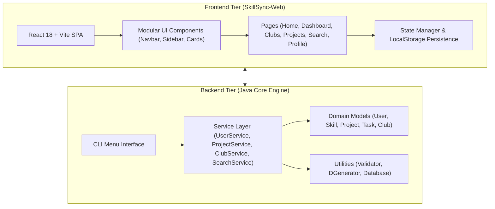

# SkillSync: Project Report & Technical Documentation

> **SkillSync** is a developer platform and mentorship ecosystem that connects programmers, facilitates skill verification, hosts corporate tech hubs, and enables collaborative open-source project building.

---

## 1. Executive Summary

In today's fast-paced tech landscape, developers often struggle to find verified mentors, engage in targeted company discussions, and collaborate on real-world projects with clear task breakdown. **SkillSync** bridges this gap by providing an end-to-end platform featuring:
- **Verified Industry Mentorship**: Smart matching of developers based on verified skills and proficiency levels.
- **Corporate Tech Clubs**: Hubs dedicated to top technology companies (Google, Amazon, Meta, Microsoft) with interview logs and community forums.
- **Collaborative Project Workspaces**: Task Kanban boards, team member rosters, and shared project resource repositories.
- **Dual-Engine Architecture**: A modular Java CLI core engine paired with a modern React + Vite single-page application (SPA).

---

## 2. System Architecture Overview

SkillSync is structured into two core tiers:
1. **Java Core Backend Engine**: Standard Java object-oriented design managing domain entities, validation routines, services, and CLI UI controllers.
2. **SkillSync Web Application**: A responsive SPA built with React, Vite, and Lucide React icons, featuring state persistence via `localStorage` and a sleek dark theme.



---

## 3. Key Modules & Features

### 3.1 User & Mentor Management
- **Skill Profiles**: Developers list programming skills along with proficiency levels (Beginner, Intermediate, Advanced, Expert).
- **Mentor Verification**: Toggleable mentor flag allowing experienced developers to accept mentees.
- **Graph Connections**: Scalable structure to manage user follow networks and mentor-mentee relationships.

### 3.2 Corporate Tech Clubs
- Dedicated hubs for leading tech companies:
  - **Google Developer Hub** (Distributed Systems & Cloud Architecture)
  - **Meta Frontend & AR Hub** (React Engine, Next-gen Web UI, WebXR)
  - **Amazon Cloud & Infra Club** (AWS Infrastructure, Microservices, Scale)
  - **Microsoft AI & Dev Hub** (Machine Learning, Azure Ecosystem, C#/.NET)
- **Features**: Discussion posts, upvoting, and verified interview experience reports.

### 3.3 Collaborative Project Discovery & Kanban
- **Project Discovery**: Filter projects by required skills, team size, and difficulty level.
- **Task Boards**: Kanban-style task tracking (*To Do*, *In Progress*, *Completed*) with assignee tagging.
- **Resource Management**: Link key documentation, repository URLs, and developer guides to specific projects.

### 3.4 Multi-Criteria Search & Filtering
- Instant, multi-parameter search across verified mentors, projects, and corporate tech clubs.
- Skill chip selection with real-time dynamic filtering.

---

## 4. Technology Stack

| Layer | Technology / Tools |
| :--- | :--- |
| **Frontend Framework** | React 18, Vite 5 |
| **UI Components & Icons** | Lucide React Icons, Modular Vanilla CSS |
| **Backend Core** | Java 17 (Object-Oriented Design) |
| **Data Models** | Encapsulated POJOs (`User`, `Project`, `Club`, `Task`, `Skill`) |
| **State & Storage** | LocalStorage API (Web), In-memory Mock Database (Java) |
| **Build & Tooling** | npm / Vite, IntelliJ IDEA |

---

## 5. Directory & File Structure

```
SkillSync/
├── .gitignore
├── PROJECT_REPORT.md
├── src/                          # Root Java Package
│   └── skillsync/
│       ├── Main.java
│       ├── graph/
│       ├── model/
│       ├── service/
│       ├── ui/
│       └── util/
└── SkillSync/                    # Project Source Bundle
    ├── SkillSync-Web/            # React + Vite Frontend
    │   ├── index.html
    │   ├── package.json
    │   ├── vite.config.js
    │   └── src/
    │       ├── components/       # Reusable UI Elements
    │       ├── pages/            # View Pages (Home, Clubs, Projects, etc.)
    │       ├── styles/           # Modular CSS Stylesheets
    │       └── data/             # Mock Data Sets
    └── src/                      # Java Source Classes
        └── skillsync/
            ├── model/            # Entity Data POJOs
            ├── service/          # Business Logic Services
            ├── ui/               # Command-Line Interfaces
            └── util/             # Helper Utilities
```

---

## 6. How to Run the Project

### 6.1 Running the Web Application
```bash
# Navigate to the Web frontend directory
cd SkillSync/SkillSync-Web

# Install npm dependencies
npm install

# Start local development server
npm run dev
```
Access the application at `http://localhost:3000/`.

### 6.2 Running the Java Core Engine
```bash
# Navigate to Java source folder
cd SkillSync/src

# Compile Java files
javac skillsync/Main.java

# Run main application
java skillsync.Main
```

---

## 7. Future Roadmap

1. **RESTful API Backend Integration**: Connect the React frontend to a Spring Boot / Node.js backend.
2. **Real-Time Chat**: WebSockets integration for direct mentor-mentee messaging.
3. **Automated Skill Testing**: Interactive coding assessments to automatically verify developer skills.
4. **OAuth 2.0 Authentication**: Sign-in with GitHub and LinkedIn integration.

---
*Report Generated for SkillSync Repository.*
